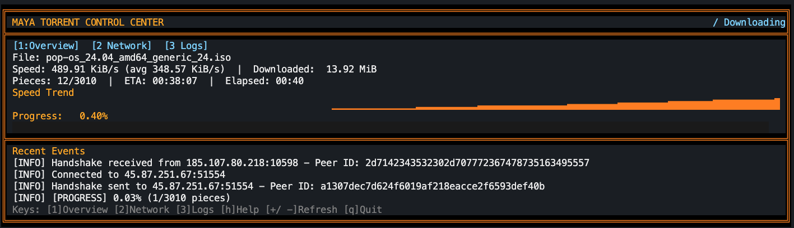

# Maya



Maya is a Python BitTorrent client project focused on torrent parsing, tracker communication, peer management, and piece/file handling.

## Requirements

- Python 3.11+
- pip

## Installation

```bash
python -m venv .venv
source .venv/bin/activate
pip install -r requirements.txt
```

## Run

```bash
python main.py
```

The default entry point loads a sample torrent file from `tests/files/popos.torrent` and starts the terminal UI.

## Tests

```bash
pytest
```

## Project Structure

- `main.py`: Application entry point
- `src/torrent.py`: Core torrent logic
- `src/tracker/`: HTTP and UDP tracker clients
- `src/peer/`: Peer communication and management
- `src/piece/`: Piece lifecycle and state management
- `src/storage/`: File preallocation and writing
- `src/ui/`: Terminal user interface
- `src/encoder/`: Bencode implementation.
- `tests/`: Unit tests

## Bencoder

This project also implements the `Bencoder`, a **lightweight, Python module** for **Bencode encoding and decoding**.

It fully supports:

- Integers (`int`)
- Strings (`str` -> `bytes`)
- Bytes (`bytes`)
- Lists (`list`)
- Dictionaries (`dict`)
- Nested structures
- Explicit errors for invalid input
- Full unit test coverage with pytest

## Contributing

Pull requests are welcome!
Enhancements such as performance optimizations, streaming decode, or additional tests are highly encouraged.

- Open issues for bugs or feature requests
- Fork the repo, implement, and submit a PR

## License

MIT License © [Soares W. / soareseng]
